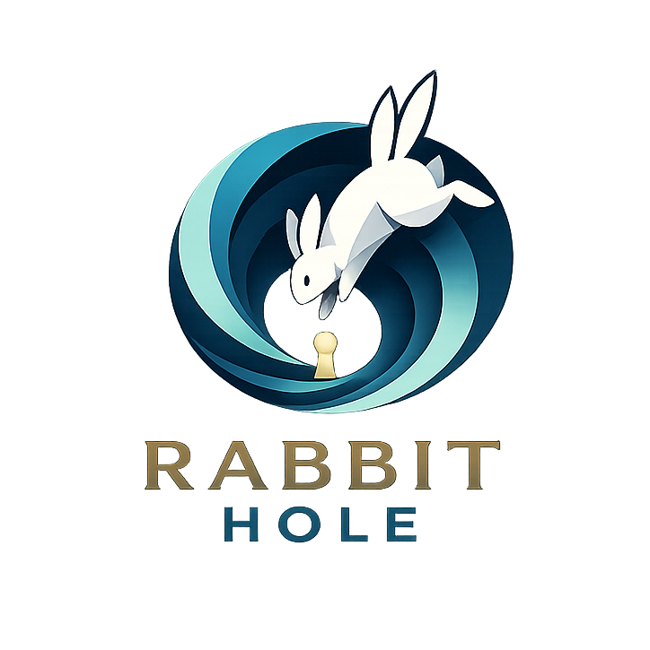

<p align="center">
  
</p>

# Rabbit Hole

Dream-inspired agent skills for concept recombination, hypothesis generation, and non-obvious ideas.

Rabbit Hole is a skill suite for agents and creative workflows. It is designed for moments when ordinary brainstorming becomes too linear, too familiar, or too eager to converge.

Instead of using dream language to decorate conclusions, Rabbit Hole treats dream-like cognition as a **recombination mechanism**:

- extract concept nodes from the current material
- inject distant concepts from unrelated domains
- temporarily suspend ordinary logic
- allow strange candidate connections to form
- reopen logical review and keep only what survives

The goal is not to produce instant answers.
The goal is to generate **questions, hypotheses, and fresh directions worth testing**.

---

## Why Rabbit Hole exists

Many idea-generation workflows fail in the same way:

- they stay too close to existing frames
- they produce polished but predictable outputs
- they collapse too quickly into conclusions
- they confuse novelty with noise

Rabbit Hole is built for a different rhythm:

1. **prepare the dream**
2. **run recombination without immediate correction**
3. **filter surviving links**
4. **translate them back into reality**
5. **validate before turning them into action**

This makes Rabbit Hole less like ordinary brainstorming and more like a staged protocol for generating candidate connections.

---

## Core principle

Rabbit Hole does **not** treat dreams as decoration.

It uses dream-inspired recombination as a working method.

The core assumption is simple:

> when familiar logical gates loosen, distant concepts can connect;
> most of those connections will dissolve, but some may reveal a real tension,
> a new mechanism, or a question worth pursuing.

---

## Included skills

### `dream-thread`
A guided recombination skill inspired by REM-like dream logic.

It:
- extracts concept nodes from the user's material
- injects foreign concepts from distant domains
- runs several rounds of constrained recombination
- produces suspended images or unresolved questions
- filters which links survive logical review
- returns candidate questions and hypotheses, not final conclusions

### `re-entry`
A translation skill for bringing dream output back into waking language.

It:
- identifies which dream elements matter
- maps them back to the source problem
- reframes them as questions, hypotheses, or research directions
- prepares them for validation

---

## Workflow

Rabbit Hole follows a staged workflow:

### 1. Prepare the dream
Before recombination begins, the skill:
- extracts 5–8 concept nodes from the material
- injects 1–2 distant concepts from unrelated domains
- states the current uncertainty as 1–2 open questions

### 2. Run the dream
The dream phase does not gather new information.

Instead, it uses recombination operations such as:
- transplant
- inversion
- scale mismatch
- role exchange
- boundary magnification
- absence experiment
- fusion

Each round leaves behind a suspended image, tension, or question.

### 3. Reopen logic
After recombination, each candidate link is reviewed:

- **survives**: worth pursuing
- **partially survives**: contains an interesting core
- **dissolves**: noise, discard

### 4. Return to reality
Only surviving links are translated back into:
- questions
- hypotheses
- conceptual directions
- research leads

### 5. Validate
Candidate ideas are checked against the original materials before they become recommendations or action items.

---

## What Rabbit Hole is good for

Rabbit Hole is especially useful when:

- a project is stuck inside familiar assumptions
- brainstorming keeps producing obvious ideas
- you need new questions, not just faster conclusions
- there is a tension, gap, or unexplained boundary in the material
- you want a structured way to generate non-obvious hypotheses

Possible use cases:
- research question generation
- concept development
- product ideation
- writing and framing
- teaching case discussion design
- exploratory problem reframing

---

## What Rabbit Hole is not

Rabbit Hole is **not**:
- random surreal writing
- a substitute for validation
- a way to smuggle conclusions in through poetic language
- a claim to literally reproduce the neuroscience of REM sleep

It is a practical ideation framework **inspired by** dream-like recombination and designed for agent workflows.

---

## Repository structure

```text
rabbit-hole/
├── README.md
├── LICENSE
├── CITATION.cff
├── docs/
├── examples/
└── skills/
    ├── dream-thread/
    │   └── SKILL.md
    └── re-entry/
        └── SKILL.md
```

## Examples

Examples will show the full arc:

source material
extracted concept nodes
injected foreign concepts
dream recombination rounds
survival filtering
translated questions and hypotheses

The goal of the examples is to make the difference visible between:

ordinary linear brainstorming
Rabbit Hole recombination
Design philosophy

Rabbit Hole is built around a few rules:

separate recombination from validation
generate candidate links before judging them
prefer questions and hypotheses over premature conclusions
allow failure
discard noise without apology
treat strange connections as material, not truth

Most dream links should dissolve.
That is normal.
The method only needs a few to survive.

## Attribution

If Rabbit Hole influences your skill, workflow, workshop, or derivative tool, please link back to this repository and cite it using the repository citation metadata.

## Citation

If you would like to cite Rabbit Hole, please use the CITATION.cff file in this repository.

## Status

Rabbit Hole is in early development.

The current version focuses on:

the first core skill: dream-thread
translation back to practical language through re-entry
examples that demonstrate where dream-inspired recombination produces more interesting candidate ideas than ordinary prompting

## Author

Created by Xi Sun.
